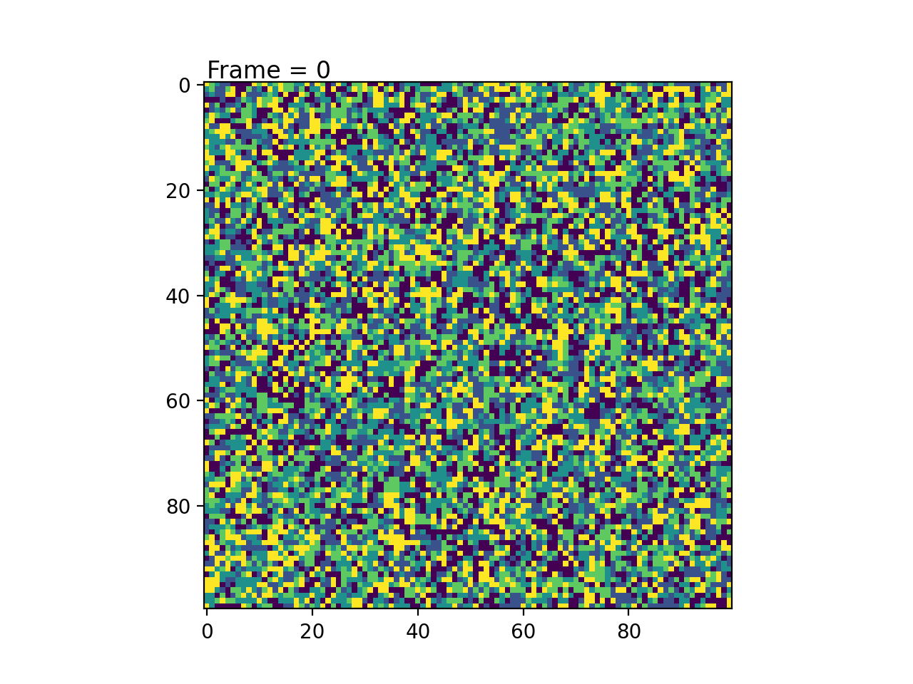

# NetworkDynamics
 A repository of programs simulating network dynamical systems

## Opinion Dynamics

Opinion Dynamics is an intersection between Sociology and Mathematical Physics, which seeks to understand how individuals' opinions evolve as they interact with others in a social network over time. One way to model the dynamics of a network's opinions is with the voter model.

The voter model is a classic model that seeks to simulate how an individual's opinion changes over time as a result of being influenced by their neighbors.

In the models that I have designed and implemented, each individual is usually surrounded by 8 others (and only 3-5 if they are on the edges). At any frame, there is a probability that their opinion will change.

### Model 1 - The Simple Voter Model
In this simple model, the changes to each individual's opinion are simply dictated by which opinion makes up the majority of their neighbor's opinions. If no opinion becomes the majority, then they will simply keep their own opinion.

This model assumes that people are simple creatures who are guaranteed to change their opinions to match those around them. This is far from being a good model, but it can show how a single opinion in a region can become dominant just because it is the most numerous.

In this implementation, we eventually reach an equilibrium state where everyone's opinions become fixed and stay like that for the rest of all time. We can interpret this result as people having their opinions influenced by being in a bubble, and where the loudest/most abundant opinion is the only one that matters.

### Model 2 - Another Simple Voter Model
This is another implementation of the simple voter model. However, an individual's opinions now changes based on a weighted probability, rather than which opinion has a clear majority in the neighborhood. This allows for minority opinions to be considered, while still giving majority opinions an advantage. 

This model assumes that people are more nuanced and won't blindly follow the majority opinion, but are more likely to change to the majority. My current implementation also gives the individual's current opinion a minimum of a 33% chance to stay the same, given that no neighbors also share the same opinion. This is to model the assumption that a person will likely keep their own opinions unless faced with overwhelming opposition.

Here, we don't reach an equilibrium state by the end of the animation, however some opinions do begin to form clusters and become more dominant. We can interpret this as a snowball effect, where larger clustered opinions gain dominance but smaller opinions have a chance to oppose them thru probability.

### Model 3 - Conformity Model
In the previous models, I assumed that opinions were discrete categories. However, in the real world, they are more continuous and nuanced. Two individuals can agree that a certain policy should be implemented, but they may disagree to what extent it should be implemented. This model allows us to represent this phenomenon. Instead of changing to a single opinion followed by their neighbors, an individual will _compromise_ with their neighbors and shift their views towards their own.

In my implementation, I had the individual take the mean opinion of their neighbors, and they would move towards that mean but not match it completely.

We can see that over time, the standard deviation of the opinions slowly approaches 0, which we can interpret as everyone's opinion becoming more uniform over time due to their compromising nature.

### Model 4 - Conformity w/ Antagonism Model

